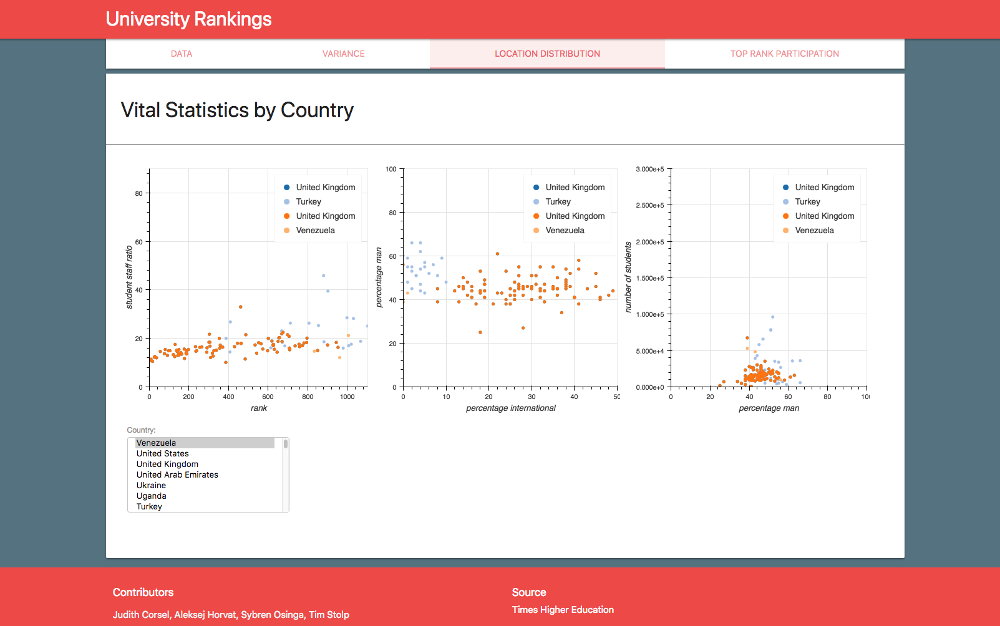

#DATA ANALISYS AND VISUALISATION
##Universiteit van Amsterdam



###Authors:
- Judith Corsel
- Aleksej Horvat
- Sybren Osinga
- Tim Stolp

### Running the Demo
The demo contains interactive Bokeh plots that require an apache server and a bokeh server.

#### Prerequisites
To run the interactive plots a python 3 environment should be installed and the www folder should be hosted by apache on port 8080.
- Python 3
- Apache 2
- pandas
- math
- bokeh
- itertools

From the 'py' folder the plots can run using
```
bokeh serve ranks_through_years.py viewlocation2.py variance.py --allow-websocket-origin localhost:8080
```

#### Viewing the Demo
The presentation is now available at http://localhost:8080/main.html

### Sources:
Rankings per year: 'https://www.timeshighereducation.com/world-university-rankings'
Total University count per Country: 'http://www.webometrics.info/en/node/54'
